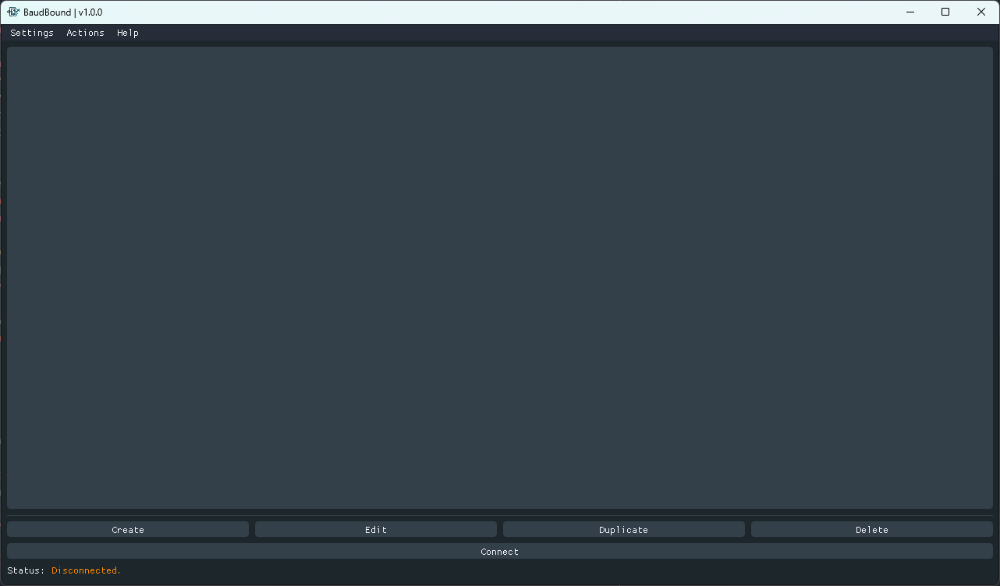
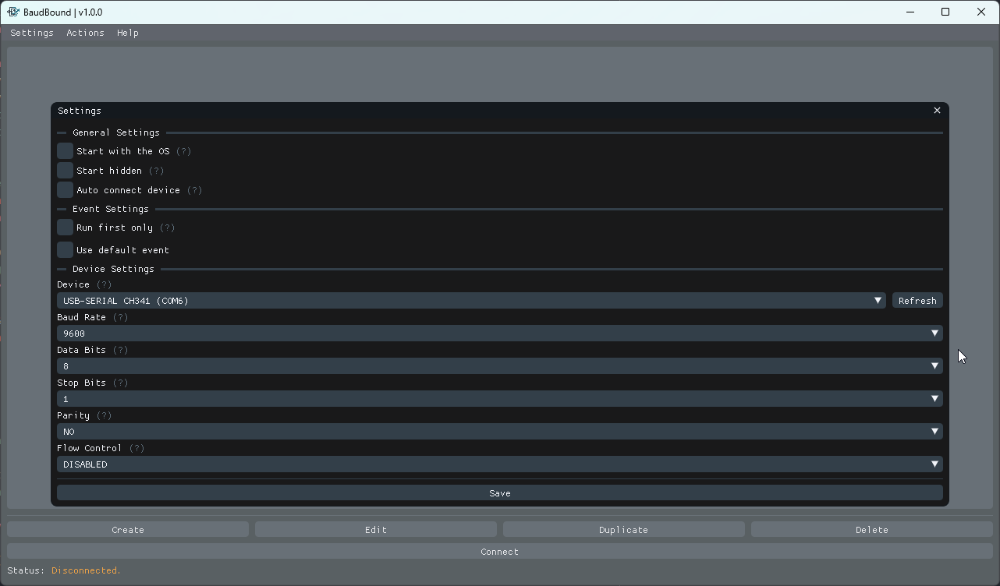
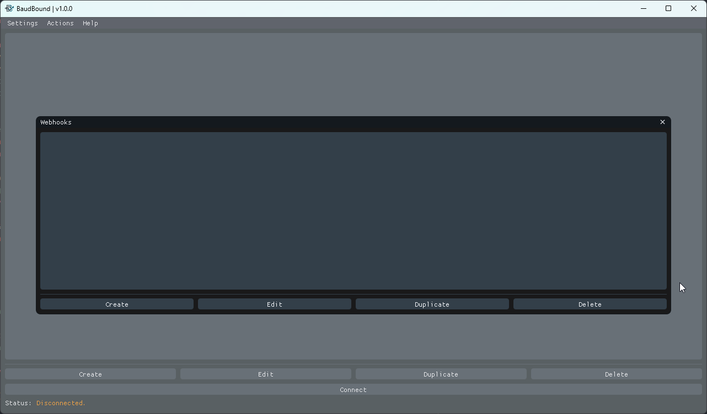
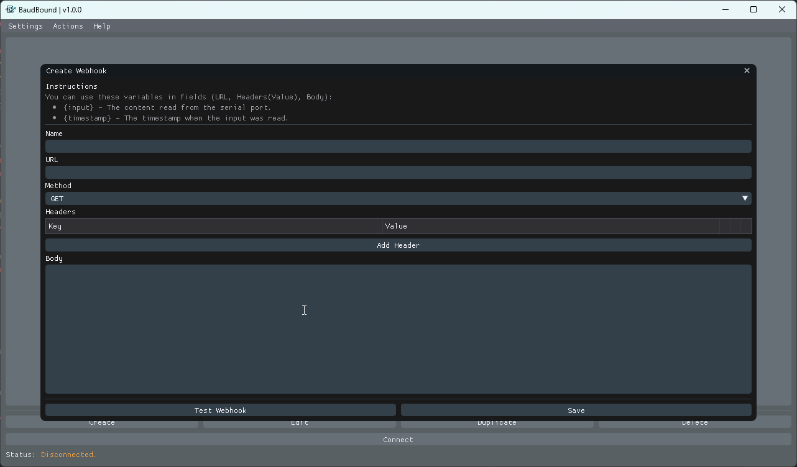
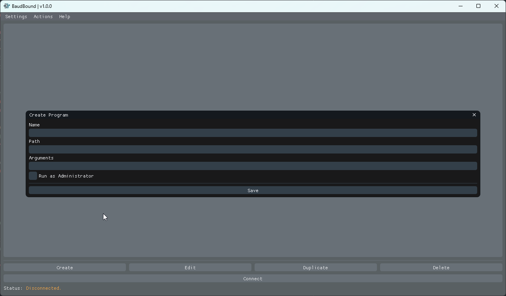

<div align="center">
  
  <br/><br/>

  <p>A lightweight event-driven automation engine that maps serial port data to system actions.</p>

  
  
  
  
  

</div>

---

## What is BaudBound?

BaudBound listens to a serial port and fires configurable actions whenever incoming data matches your conditions. Hook up any serial device — a microcontroller, a barcode scanner, a custom sensor — and turn its output into webhooks, launched programs, opened URLs, or simulated keystrokes.

## Features

- **Serial port listener** — configurable baud rate, data bits, stop bits, parity, and flow control
- **Condition matching** — starts with, ends with, contains, or full regex match
- **Multiple action types** per event:
  - Call a webhook (GET, POST, PUT, PATCH, DELETE, HEAD, OPTIONS)
  - Launch a program (with optional arguments and Run As Admin)
  - Open a URL
  - Type text via clipboard paste
- **Variable substitution** — use `{input}` and `{timestamp}` anywhere in action values
- **Default event** — a fallback event that fires when nothing else matches
- **System tray** — minimize to tray, auto-connect on startup, connect/disconnect from tray menu
- **Auto-reconnect** — automatically reconnects if the device is unplugged
- **Update checker** — notifies you of new releases on startup

## Screenshots

<div align="center">
  
  
  
  
  
</div>

## Installation

Download the latest release from the [Releases](../../releases) page and run:

```bash
java -jar baudbound-1.0.0.jar
```

Java 21 or newer is required.

## Building from source

```bash
git clone https://github.com/NATroutter/BaudBound.git
cd BaudBound
mvn package
java -jar target/baudbound-1.0.0.jar
```

## Quick start

1. Open **Settings** and configure your serial device (port, baud rate, etc.)
2. Go to **Webhooks** or **Programs** to set up the actions you want to trigger
3. Create an **Event** — add conditions to filter incoming data and actions to run when they match
4. Click **Connect** — BaudBound will start listening

## Configuration

All settings are saved automatically to a JSON file in the application directory. No manual editing required.

## Author

Made by [NATroutter](https://natroutter.fi)

---

<div align="center">
  
</div>